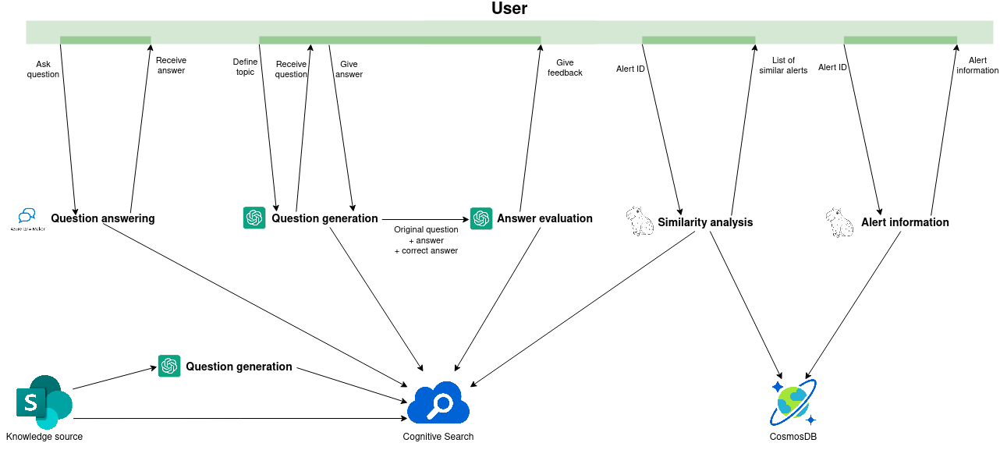

# open-capivara-interface-chat

Chatbot interface for the Capivara project, that is able to accomplish the following tasks:
* Question answering
* Question generation
* Answer evaluation
* Similarity analysis
* Alert information

Some of those tasks are implemented in the Capivara backend, and some where implemented here exclusively for this chatbot (maybe they will be moved to the main Capivara backend in future).

The system is build using Azure services, including but not limited to:
* Azure bot
* Azure Cognitive Services - Conversational Language Understanding
* Azure Cognitive Services - QnA maker
* Azure Cognitive Search
* Azure Cosmos DB

Overview of how the user interacts with all the features:

